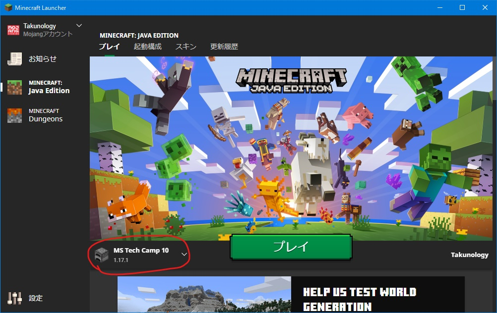
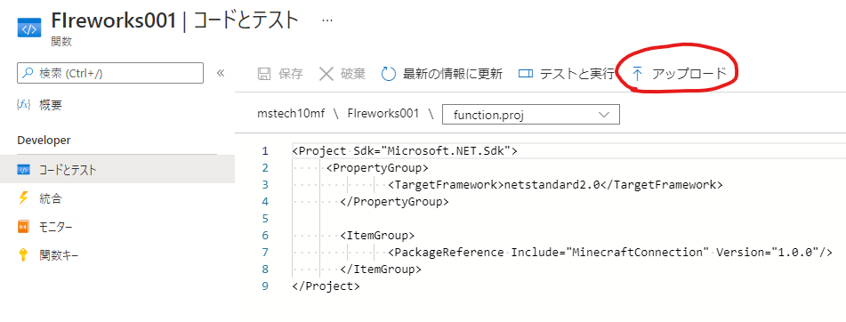

# MS Tech Camp #10 - Pre
サーバ負荷テスト（8月6日用）</br>
今回はリハーサルではないので純粋にマイクラを楽しんでください！</br>


(接続先のアドレスとパスワードはチャットでお伝えします。)

# 準備
Minecraft本体を準備してください。

<details><summary>Java版の設定</summary>
<div>

マイクラ本体を起動し、`起動構成`タブをクリックします。`NewInstallation`をクリックし、必要事項を記入していきます。名前とゲームディレクトリは自由に決めてください。バージョンは必ず `1.17.1` にしてください。

|名前|設定例|
|--|--|
|名前|MS Tech Camp 10|
|バージョン|1.17.1|
|ゲームディレクトリ|C:\Users\hoge\Desktop\Minecraft|

できたら保存をクリックします。最初の画面に戻って、起動構成で作成したプロファイルを選択し、`プレイ`をクリックしてください。



起動後はマルチプレイを選択し、サーバの追加から指定されたアドレスを入力します。

</div></details>

<details><summary>Windows10版の設定</summary>
<div>

PowerShellにて次のコマンドを実行します。

```
CheckNetIsolation LoopbackExempt -a -n="Microsoft.MinecraftUWP_8wekyb3d8bbwe"
```

このあとの手順については事前資料を参照してください。

</div></details>

<details><summary>iOS版とAndroid版の設定</summary>
<div>

マイクラのアプリをそのまま起動し、サーバ設定を行うだけです。</br>
Windows10版と同様の設定を行います。

</div></details>

<details><summary>PS4版 / Switch版 / XBOX版の設定</summary>
<div>

ゲーム本体のネットワーク設定にてDNSを次のように設定します。

|項目|値|
|--|--|
|優先DNS|104.238.130.180|
|代替DNS|8.8.8.8|

設定を保存してマイクラを起動してください。</br>
このあとの設定手順については事前資料を参照してください。Win10版と同じ操作です。
</div></details>
</br>
Azure Functionsも使用する予定ですが、リソースの作成に関しては事前資料を確認してください。</br>

マイクラの操作方法についても簡単に説明します。

# 検証1
全員が止まった状態で花火を打ち上げます。</br>
花火を打ち上げるプログラムの実行はたくのろじぃが行うのでそのままお待ち下さい。

(普通に、花火を楽しんでいただくだけです！)

# 検証2
全員が動き回っている状態で花火を打ち上げます。</br>
皆さんには地面をかけていただいたり、木を伐っていただいたり、空を飛んで動き回っていただきます。BE版から参加するとブロックを破壊できない場合があるので、その場合は動き回ってください。

# 検証3
Azure Functions や Visual Studio などを使用して皆さんにも花火を打ち上げていただきます。このとき、皆さんは花火の見える角度で立ち止まってください。

Functionsのトリガーは任意のもので結構です。関数の状態は`無効`にしておき、`コードとテスト`から実行していきます。

今回は MinecraftConnection パッケージを使用します。

<details><summary>Visual Studio / VSCode で導入する場合</summary>
<div>
NuGetパッケージマネージャーコンソールから

```
install-package MinecraftConnection
```

を実行して導入してください。VSCodeの場合は入力欄に `MinecraftConnection` と入力すると候補が出てきます。</br>

</div></details>

<details><summary>Azure Functionsで導入する場合</summary>
<div>

NuGetパッゲージを導入するには `functions.proj` というファイルを作成して、このように記述してください。

```xml
<Project Sdk="Microsoft.NET.Sdk">
     <PropertyGroup>
              <TargetFramework>netstandard2.0</TargetFramework>
       </PropertyGroup>
       <ItemGroup>
              <PackageReference Include="MinecraftConnection" Version="1.0.0"/>
       </ItemGroup>
</Project>
```

このファイルを Functions の`コードとテスト`の`アップロード`からアップしてください。もし、アップロードしてもコードが記述されていないようでしたら、上記のコードを再度記述し、保存してください。



</div></details>

</br>

## MinecraftConnectionの使い方
MinecraftConnection を使用するには、MinecraftCommandsのインスタンスを生成してから作成します。</br>
コンストラクタの引数には

- サーバのアドレス（string）
- サーバのポート番号（ushort）= 25575
- サーバのパスワード （string）

を入力します。ポート番号はマイクラサーバ接続用とコマンド送信用で異なるので注意してください。

```cs
using System;
using MinecraftConnection;
using MinecraftConnection.Items;

static string address = "";
static ushort port = 25575;
static string pass = "";

static MinecraftCommands commands = new MinecraftCommands(address, port, pass);

public static void Run(TimerInfo myTimer, ILogger log)
{
    commands.SetOffFireworks(200, 60, 300, FireworksItems.LeargeBallBlue);
}
```

花火を打ち上げるメソッドは `SetOffFireworks` です。引数にはそれぞれ

- x 座標 (int)
- y 座標 (int)
- z 座標 (int)
- 花火アイテム (Fireworksクラス)

が入ります。花火アイテムを作るには、すでに用意されている静的クラスの `FireworksItems` を使用するか、自分で定義するかのどちらかになります。

今回、座標に関しては (x, y, z) = (-62, 68, 92) あたりがちょうど良いと思います。ここから乱数などを使用して前後左右に揺さぶると面白いかもしれません。

ちなみに、同じ形状の花火アイテムをコレクションにまとめたものがあり、`FireworksItemItemList`が利用できます。（Markdown書いてて気づきましたが誤字ってますね...。直しておきます...。）

```cs
using MinecraftConnection;
using MinecraftConnection.Items;
//インスタンス化省略

foreach(var item in FireworksItemItemList.LeargeBallList)
{
    commands.SetOffFireworks(x, y, z, item);
}
```

## 花火アイテムの作り方
花火アイテムを作るには `Fireworks`クラスを使用します。

```cs
var fireworks = new Fireworks(20, 2, FireworksShapes.LargeBall, true, false, FireworksColors.BLUE, FireworksColors.RED);
```

コンストラクタの引数は

- 花火が爆発するまでの時間 (int) 
- 花火の飛距離 (int)
- 花火の形状 (FireworksShape)
- きらめき効果 (bool)
- 流星効果 (bool)
- 爆発したときの色 (FireworksColors)
- フェードアウトしてくときの色 (FireworksColors)

となっています。色に関しては、複数指定することもでき、

```cs
var color = new List<FireworksColors>()
{
    FireworksColors.GREEN,
    FireworksColors.ORANGE,
    FireworksColors.YELLOW
};
var fireworks = new Fireworks(20, 2, FireworksShapes.LargeBall, true, false, color, FireworksColors.RED);
```

とすることで緑、オレンジ、黄色の爆発をしたあとに、赤色でフェードアウトしていくような花火になります。
また、現実世界での1秒はマイクラの世界では 1/20[秒]= 0.05[秒] = 1[tick] になりますので、上記の例では打ち上げて1秒後に花火が爆発するようになります。

また、花火が爆発したときの形状を5種類から選ぶことができます。

- LargeBall
- SmallBall
- Star
- Creeper
- Burst

いろいろ試してみてください。

## プログラムレシピ集
打ち上げ花火の例です。参考にしてください。</br>
(サーバアドレスとパスワードを変更してください。)

<details><summary>その1</summary>
<div>

```cs
using System;
using MinecraftConnection;
using MinecraftConnection.Items;

static string address = "";
static ushort port = 25575;
static string pass = "";
static MinecraftCommands commands = new MinecraftCommands(address, port, pass);

public static void Run(TimerInfo myTimer, ILogger log)
{
    int x = -72;
    int y = 68;
    int z = 92;

    var rnd = new Random();
    for (int i = 0; i < 10; i++)
    {
        commands.SetOffFireworks(x, y, z + rnd.Next(-10, 10), FireworksItems.CreeperLime);
        commands.SetOffFireworks(x, y, z + rnd.Next(-10, 10), FireworksItems.LeargeBallBlue);
        commands.SetOffFireworks(x, y, z + rnd.Next(-10, 10), FireworksItems.SmallBallCyan);
        commands.SetOffFireworks(x, y, z + rnd.Next(-10, 10), FireworksItems.BurstPinkFlickerTrail);
        commands.Wait(1000);
    }
}
```

</div></details>

<details><summary>その2</summary>
<div>

```cs
using System;
using MinecraftConnection;
using MinecraftConnection.Items;

static string address = "";
static ushort port = 25575;
static string pass = "98ds3b_0ees";
static MinecraftCommands commands = new MinecraftCommands(address, port, pass);

public static void Run(TimerInfo myTimer, ILogger log)
{
    int x = -72;
    int y = 68;
    int z = 92;
    
    var rnd = new Random();
    foreach(var item in FireworksItemItemList.LeargeBallList)
    {
        commands.SetOffFireworks(x, y, z + rnd.Next(-20, 20), item);
    }
}
```

</div></details>

<details><summary>その3</summary>
<div>

```cs
using System;
using MinecraftConnection;
using MinecraftConnection.Items;

static string address = "mstechcamp10.japaneast.cloudapp.azure.com";
static ushort port = 25575;
static string pass = "98ds3b_0ees";
static MinecraftCommands commands = new MinecraftCommands(address, port, pass);

public static void Run(TimerInfo myTimer, ILogger log)
{
    int x = -72;
    int y = 68;
    int z = 92;

    var rnd = new Random();
    for(int i = 0; i < 10; i++)
    {
        Kiku(x, y, z + rnd.Next(-20, 20), 20);
    }
}

public static void Kiku(int x, int y, int z, int time)
{
    Fireworks fireworksIn = new Fireworks(time, 2, FireworksShapes.SmallBall, false, true, FireworksColors.RED, FireworksColors.RED);
    Fireworks fireworksOut = new Fireworks(time, 2, FireworksShapes.LargeBall, false, true, FireworksColors.ORANGE, FireworksColors.ORANGE);
    commands.SetOffFireworks(x, y, z, fireworksOut);
    commands.SetOffFireworks(x, y, z, fireworksIn);
    commands.Wait(1000);

    fireworksIn = new Fireworks(time, 2, FireworksShapes.SmallBall, false, true, FireworksColors.GREEN, FireworksColors.GREEN);
    fireworksOut = new Fireworks(time, 2, FireworksShapes.LargeBall, false, true, FireworksColors.LIME, FireworksColors.LIME);
    commands.SetOffFireworks(x, y, z + 14, fireworksOut);
    commands.SetOffFireworks(x, y, z + 14, fireworksIn);
    commands.Wait(1000);

    fireworksIn = new Fireworks(time, 2, FireworksShapes.SmallBall, false, true, FireworksColors.BLUE, FireworksColors.BLUE);
    fireworksOut = new Fireworks(time, 2, FireworksShapes.LargeBall, false, true, FireworksColors.LIGHTBLUE, FireworksColors.LIGHTBLUE);
    commands.SetOffFireworks(x, y, z + 28, fireworksOut);
    commands.SetOffFireworks(x, y, z + 28, fireworksIn);
    commands.Wait(1000);
}
```

</div></details>

<details><summary>その4</summary>
<div>

```cs
using System;
using MinecraftConnection;
using MinecraftConnection.Items;

static string address = "mstechcamp10.japaneast.cloudapp.azure.com";
static ushort port = 25575;
static string pass = "98ds3b_0ees";
static MinecraftCommands commands = new MinecraftCommands(address, port, pass);

public static void Run(TimerInfo myTimer, ILogger log)
{
    int x = -52 - 20;
    int y = 68;
    int z = 92 + 10;

    var rnd = new Random();

    for (int i = 0; i < 100; i++)
    {
        var fireworks = new Fireworks(20, 2, FireworksShapes.LargeBall, true, true, GetRandomColors(), GetRandomColors());
        commands.SetOffFireworks(x + rnd.Next(-20, 0), y, z + rnd.Next(-20, 20), fireworks);
        commands.Wait(50 * rnd.Next(5, 10));
    }
}

public static List<FireworksColors> GetRandomColors()
{
    var rnd = new Random();
    var colorList = new List<FireworksColors>();

    for (int i = 0; i < rnd.Next(1, 3); i++)
    {
        switch (rnd.Next(0, 15))
        {
            case 0:
                colorList.Add(FireworksColors.BLACK);
                break;
            case 1:
                colorList.Add(FireworksColors.BLUE);
                break;
            case 2:
                colorList.Add(FireworksColors.BROWN);
                break;
            case 3:
                colorList.Add(FireworksColors.CYAN);
                break;
            case 4:
                colorList.Add(FireworksColors.GRAY);
                break;
            case 5:
                colorList.Add(FireworksColors.GREEN);
                break;
            case 6:
                colorList.Add(FireworksColors.LIGHTBLUE);
                break;
            case 7:
                colorList.Add(FireworksColors.LIGHTGRAY);
                break;
            case 8:
                colorList.Add(FireworksColors.LIME);
                break;
            case 9:
                colorList.Add(FireworksColors.MAGENTA);
                break;
            case 10:
                colorList.Add(FireworksColors.ORANGE);
                break;
            case 11:
                colorList.Add(FireworksColors.PINK);
                break;
            case 12:
                colorList.Add(FireworksColors.PURPLE);
                break;
            case 13:
                colorList.Add(FireworksColors.RED);
                break;
            case 14:
                colorList.Add(FireworksColors.WHITE);
                break;
            default:
                colorList.Add(FireworksColors.YELLOW);
                break;
        }
    }
    return colorList;
}
```


</div></details>

</br>

# 検証4
検証3で作成したプログラムを実行しながら花火を打ち上げつつ、皆さんで動き回ります。</br>

# その5
その他、気になった点について話し合います。

(個人的に気になっている点)
- Azure Functions に絞るべきか
- 統合版は Win10 / Android / iOS 版に絞るべきか

