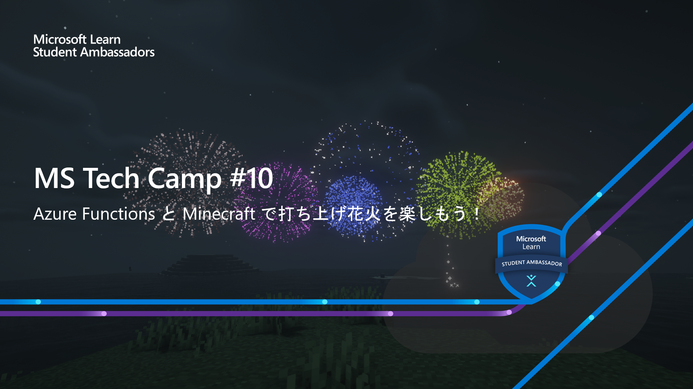
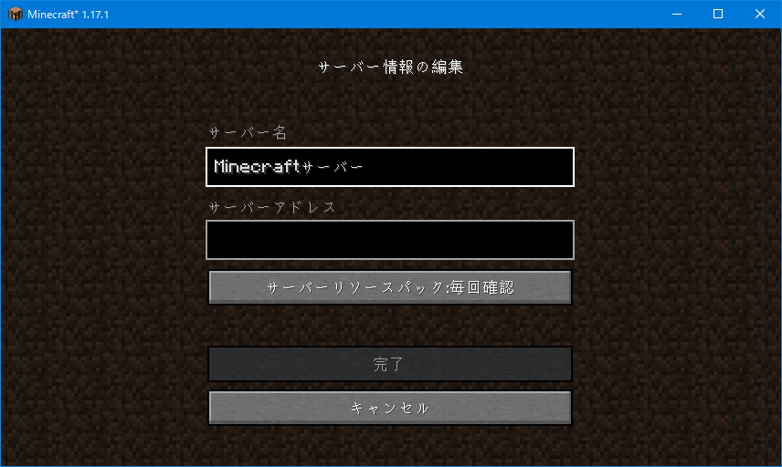
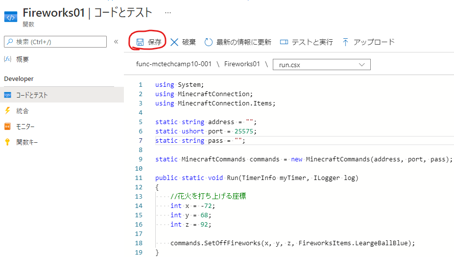

<h1>MS Tech Camp #10 </br>
Azure Functions と Minecraft で打ち上げ花火を楽しもう！</h1>



[MS Tech Camp #10](https://mspjp.connpass.com/event/220071/)で使用するハンズオン資料です。

Azure Functions の .NET ランタイムを使用してC#プログラミングを行い、Minecraftで花火を打ち上げます。参加者全員で花火を打ち上げて、マイクラ花火大会を楽しみましょう！

# 1. Minecraft の設定
今回は Minecraft Java版と統合版の方が参加できるように、クロスプレイが可能なマイクラサーバを用意しました。マイクラサーバの接続先アドレスを伝えますので、そのアドレスを使用してログインします。

<details><summary>Java版の設定</summary>
<div>

マイクラ本体を起動し、`起動構成`タブをクリックします。`NewInstallation`をクリックし、必要事項を記入していきます。名前とゲームディレクトリは自由に決めてください。バージョンは必ず `1.17.1` にしてください。


|名前|設定例|
|--|--|
|名前|MS Tech Camp 10|
|バージョン|1.17.1|
|ゲームディレクトリ|C:\Users\hoge\Desktop\mstechcamp10|

できたら保存をクリックします。最初の画面に戻って、起動構成で作成したプロファイルを選択し、`プレイ`をクリックしてください。


起動後は`マルチプレイ`を選択し、`サーバの追加`から指定されたアドレスを入力します。

入力できたら`保存`をクリックし、作成したサーバを選択して `サーバに参加` をクリックすれば、ログイン出来ます。


</div></details>

<details><summary>統合版の設定</summary>
<div>

統合版はWin10版、iOS版、Android版の方のみを対象としています。

まず、Win10版の方は PowerShell にて次のコマンドを実行してください。

```
CheckNetIsolation LoopbackExempt -a -n="Microsoft.MinecraftUWP_8wekyb3d8bbwe"
```

ここからはiOS版とAndroid版共通の設定です。

Minecraftを開いたら`サーバ`タブから`サーバの追加`をクリックします。


サーバアドレスを入力して`遊ぶ`をクリックすると、サーバにログイン出来ます。


統合版からのログインでは、描画までに時間がかかりますので1分ほどお待ち下さい。
</div></details>

# 2. Azrue Functions の作成
[Azure ポータル]()にて `リソースの作成`をクリックします。


`関数アプリ`を選択します。


関数アプリの作成画面が表示されるので、必要事項に記入していきます。関数アプリの名称は一意である必要があります。

|項目|記入例|
|--|--|
|サブスクリプション|Azure for Students|
|リソースグループ|rg-mstechcamp10|
|関数アプリ|func-mstechcamp10-001|
|公開|コード|
|ランタイムスタック|.NET|
|バージョン|3.1|
|地域|Japan East|

<details><summary>リソースグループの新規作成方法</summary>
<div>

`新規作成`をクリックし、リソースグループ名を記入します。


記入ができたら`OK`をクリックします。
</div></details>
</br>


関数アプリの確認画面が表示されるので、このまま `作成` をクリックします。


デプロイが完了したら、`リソースに移動` をクリックします。


関数アプリの概要ページが表示されるので、左側のメニューから `関数` を選択し、`作成` をクリックします。右側に `関数の作成` というページが開くので次のように設定します。

|項目|記入例|
|--|--|
|開発環境|ポータルでの開発|
|テンプレート|Timer trigger|
|新しい関数|Fireworks01|
|Schedule|0 */5 * * * *|


記入できたら `作成` をクリックします。

関数アプリが作成されると、その関数のページが開きます。タイマートリガーにしているので、一定時間が経過すると自動で関数アプリが実行されるようになっています。今回は手動で動かすので、まずは `無効化` をクリックして関数アプリの自動起動を停止します。


これで関数アプリの作成手順は終了です。ここからは NuGet パッケージの導入とC#プログラミングを行い、花火を打ち上げます。


# 3. 花火を打ち上げる
マイクラで花火を打ち上げるために必要なパッケージ（ライブラリ）を導入します。

PC上で `function.proj` というファイルを作成してください。（ファイル名が正しくないとパッケージを導入出来ません。）

左側のメニューから `コードとテスト` を選択し、`アップロード` をクリックします。


作成した `function.proj` をアップロードし、ドロップダウンメニューからこのファイルを選択します。


ここに、次のような内容を記述します。

```xml
<Project Sdk="Microsoft.NET.Sdk">
     <PropertyGroup>
              <TargetFramework>netstandard2.0</TargetFramework>
       </PropertyGroup>
       <ItemGroup>
              <PackageReference Include="MinecraftConnection" Version="1.1.0"/>
       </ItemGroup>
</Project>
```

できたら `保存` をクリックします。


ドロップダウンメニューから `run.csx` を選択してエディタを開きます。ここから花火を打ち上げるプログラム（C#）を記述していきます。


まずは、関数アプリを実行してマイクラで花火を打ち上げるための手順を説明します。下記のコードをコピーして貼り付けて貼り付けてください。（サーバアドレスとパスワードはチャットに貼り付けたものを使用してください。）

```cs
using System;
using MinecraftConnection;
using MinecraftConnection.Items;

static string address = "配布したサーバアドレス";
static ushort port = 25575;
static string pass = "配布したパスワード";

static MinecraftCommands commands = new MinecraftCommands(address, port, pass);

public static void Run(TimerInfo myTimer, ILogger log)
{
    //花火を打ち上げる座標
    int x = -72;
    int y = 68;
    int z = 92;

    var fireworks = new Fireworks(20, FireworksShapes.LargeBall, FireworksColors.RED, FireworksColors.RED);
    commands.SetOffFireworks(x, y, z, fireworks);
}
```

貼り付けたら `保存` をクリックしてください。



コンパイルが完了すると、ページ下にあるログにて水色の文字で `Compilation succeeded.` と表示されます。

プログラムを実行する場合は `テストと実行` から、


`実行`をクリックします。（ボディの中身は空のままで実行します。）


実行ボタンを押してすぐにマインクラフトの画面を表示すると、花火を見ることができます。


Functions が正しく実行出来ていれば、画像の赤線で引いた部分のような文字列が表示されます。


## マイクラの操作について
前後左右に動くには `W` `A` `S` `D` キーを使用します。

今回はクリエイティブモードなので、スペースキーを2回連続で押すと空中に浮くことが出来ます。空中に浮いている状態でスペースキーを長押しすると上昇、SHIFTキーを押すと下降することができ、地面に着地すると歩くことが出来ます。

マイクラ上でキーボードの `/` キーを押すとウィンドウをアクティブにしたまま別のウィンドウ操作ができるようになります。マイクラの操作に戻る場合は `ESC` を押します。

画面上のものが邪魔であれば、`F1` キーを押すと消すことができます。もう一度押すと元に戻すことができます。また、`F3`キーを押すとマイクラの情報が表示されます。座標を確認する場合は赤線の部分を確認してください。


# 4. 花火製作のレシピ
ここからは皆さんで花火を作成して打ち上げてみましょう。下に花火の形状や色についてまとめましたので、参考にしてみてください！

## 4.1 花火の作り方
花火アイテムを作るには、`Fireworks` クラスを使用します。先程の例では、

```cs
var fireworks = new Fireworks(20, FireworksShapes.LargeBall, FireworksColors.RED, FireworksColors.RED);
```

となっていました。`Fireworks` の引数にはそれぞれ、

|引数の型|説明|
|int|花火が爆発するまでの時間 [tick]|
|FireworksShapes|花火の形状|
|FireworksColors|花火が爆発したときの色|
|FireworksColors|花火がフェードアウトしていくときの色|

が入ります。これらの値を変更することでオリジナルの花火を作ることができます。

## 4.2 花火の形状
マイクラの花火の形は5種類あります。

|花火の形|書き方|
|--|--|
|大玉花火|FireworksShapes.LargeBall|
|小玉花火|FireworksShapes.SmallBall|
|クリーパー花火|FireworksShapes.Creeper|
|星型花火|FireworksShapes.Star|
|破裂する花火|FireworksShapes.Burst|

花火の形状の例


## 4.3 花火の色
マイクラの花火の色は 16 色あります。

|色|書き方|
|--|--|
|黒色|BLACK|
|赤色|RED|
|緑色|GREEN|
|茶色|BROWN|
|青色|BLUE|
|紫色|PURPLE|
|シアン色|CYAN|
|薄灰色|LIGHTGRAY|
|灰色|GRAY|
|桃色|PINK|
|ライム色|LIME|
|黄色|YELLOW|
|水色|LIGHTBLUE|
|マゼンタ色|MAGENTA|
|橙色|ORANGE|
|白色|WHITE|


すべての色を打ち上げるサンプルコード：

```cs
public static void Run(TimerInfo myTimer, ILogger log)
{
    //花火を打ち上げる座標
    int x = -72;
    int y = 68;
    int z = 92;

    List<Fireworks> fireworks = new List<Fireworks>()
    {
       new Fireworks(20, FireworksShapes.LargeBall, FireworksColors.BLACK, FireworksColors.BLACK),
       new Fireworks(20, FireworksShapes.LargeBall, FireworksColors.BLUE, FireworksColors.BLUE),
       new Fireworks(20, FireworksShapes.LargeBall, FireworksColors.BROWN, FireworksColors.BROWN),
       new Fireworks(20, FireworksShapes.LargeBall, FireworksColors.CYAN, FireworksColors.CYAN),
       new Fireworks(20, FireworksShapes.LargeBall, FireworksColors.GRAY, FireworksColors.GRAY),
       new Fireworks(20, FireworksShapes.LargeBall, FireworksColors.GREEN, FireworksColors.GREEN),
       new Fireworks(20, FireworksShapes.LargeBall, FireworksColors.LIGHTBLUE, FireworksColors.LIGHTBLUE),
       new Fireworks(20, FireworksShapes.LargeBall, FireworksColors.LIGHTGRAY, FireworksColors.LIGHTGRAY),
       new Fireworks(20, FireworksShapes.LargeBall, FireworksColors.LIME, FireworksColors.LIME),
       new Fireworks(20, FireworksShapes.LargeBall, FireworksColors.MAGENTA, FireworksColors.MAGENTA),
       new Fireworks(20, FireworksShapes.LargeBall, FireworksColors.ORANGE, FireworksColors.ORANGE),
       new Fireworks(20, FireworksShapes.LargeBall, FireworksColors.PINK, FireworksColors.PINK),
       new Fireworks(20, FireworksShapes.LargeBall, FireworksColors.PURPLE, FireworksColors.PURPLE),
       new Fireworks(20, FireworksShapes.LargeBall, FireworksColors.RED, FireworksColors.RED),
       new Fireworks(20, FireworksShapes.LargeBall, FireworksColors.WHITE, FireworksColors.WHITE),
       new Fireworks(20, FireworksShapes.LargeBall, FireworksColors.YELLOW, FireworksColors.YELLOW)
    };

    foreach(var item in fireworks)
    {
       commands.SetOffFireworks(x, y, z, item);
        commands.Wait(3000); //3秒ごとに打ち上げる
    }
}
```

## 4.4 きらめき効果をつける
花火がフェードアウトしていくときに、キラキラした効果をつけることができます。きらめき効果をつけるには、`Fireworks` クラスに `.Flicker()` をつけます。


```cs
var fireworks = new Fireworks(20, FireworksShapes.LargeBall, FireworksColors.CYAN, FireworksColors.CYAN).Flicker();
```


## 4.5 流星効果をつける
花火がフェードアウトしていくときに、光の軌跡が残るような効果をつけることができます。流星効果をつけるには、`Fireworks` クラスに `.Trail()` をつけます。

```cs
var fireworks = new Fireworks(20, FireworksShapes.LargeBall, FireworksColors.CYAN, FireworksColors.CYAN).Trail();
```


## 4.6 きらめき効果と流星効果をつける
`.Flicker()` と `.Trail()` をつけることで両方の効果を併せ持った花火を作ることができます。（これらは順不同です。）

```cs
var fireworks = new Fireworks(20, FireworksShapes.LargeBall, FireworksColors.CYAN, FireworksColors.CYAN).Flicker().Trail();
```


## 4.7 花火を打つまでの時間を調整する
連続で花火を打ち上げると、同じ座標で爆発して見えなくなってしまうので、時間をずらすことをおすすめします。指定した時間待機するには

```
commands.Wait(2000);
```

を使用します。引数にはミリ秒の数値が入ります。（1000ミリ秒 = 1秒）
## 4.8 ランダムに花火を打ち上げる
座標と色をランダムにして花火を打ち上げるサンプルコードを紹介します。座標を変更して試してみてください！（y座標に関しては地面よりも高い場所でないと、花火が打ち上がりません。）

```cs
public static void Run(TimerInfo myTimer, ILogger log)
{
    //花火を打ち上げる座標
    int x = -72;
    int y = 68;
    int z = 92;

    var rnd = new Random();

    for(int i = 0; i < 100; i++)
    {
       var fireworks = new Fireworks(20, FireworksShapes.LargeBall, FireworksOptions.RandomColors(1, 5), FireworksOptions.RandomColors(1, 5));
       commands.SetOffFireworks(x + rnd.Next(0, 20), y + rnd.Next(-5, 10), z + rnd.Next(-30, 30), fireworks);
       commands.Wait(200);
    }
}
```


## 4.9 補足
今回、関数アプリはタイマートリガーを使用しているため、一定時間ごとに関数を動かすことができます。余裕がある方は、先程無効に設定した関数アプリを `有効` にしてみてください。デフォルトでは 5 分ごとに花火が打ち上がります。

# 5. リソースの削除
今回作成したリソースとリソースグループの削除方法についてです。まず、Azure ポータルのホームから `リソースグループ` を選択します。


今回作成したリソースグループ名を選択し、`リソースグループの削除` をクリックします。削除するにはリソースグループ名の入力が必要です。入力が完了したら、下の `削除` をクリックして、関数アプリのリソースをまるごと削除できます。


# アンケート
MS Tech Camp #10 へご参加いただきありがとうございました！</br>
アンケートへのご協力をお願いします！ </br>
https://forms.gle/dXwEDRvK1mAy86t76

# 参考
トリガーを使用して Azure 関数を実行する</br>
https://docs.microsoft.com/ja-jp/learn/modules/execute-azure-function-with-triggers/

Minecraft with Code Project </br>
https://www.mcwithcode.com/